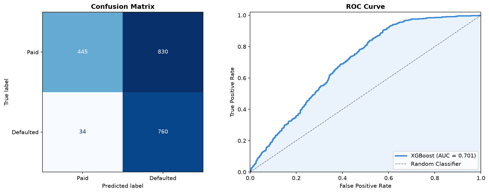

<div align="center">

# BNPL Credit Risk

**Predicting Buy-Now-Pay-Later default risk — from a raw dataset to a production-grade, testable, auditable scoring pipeline.**

[](pyproject.toml)
[](pyproject.toml)
[](pyproject.toml)
[](pyproject.toml)
[](tests/)
[](src/bnpl_credit_risk/models/factory.py)

</div>

---

## Table of contents

1. [Overview](#overview)
2. [The one decision that matters: leakage](#the-one-decision-that-matters-leakage)
3. [Results](#results)
4. [Architecture](#architecture)
5. [Quickstart](#quickstart)
6. [Project layout](#project-layout)
7. [Configuration](#configuration)
8. [Testing & quality](#testing--quality)
9. [Documentation](#documentation)
10. [Roadmap](#roadmap)

---

## Overview

A BNPL ("pay in installments") merchant needs to decide, at checkout,
whether a customer is likely to default. This repository takes that problem
from a single exploratory notebook to an installable Python package with a
validated data contract, a reproducible training pipeline, calibrated
probabilities, and a nightly batch-scoring command — the kind of thing that
can actually run unattended in production.

| | |
|---|---|
| **Business question** | Should this BNPL application be approved? |
| **Target** | `default_flag` (binary), ~39% positive rate |
| **Data** | 10,345 transactions, 17 raw columns, Jan 2023 – Dec 2024, 6 markets |
| **Model** | XGBoost, wrapped in one serializable `sklearn.Pipeline` |
| **Origin** | Migrated from [`Dev/bnpl-credit-risk-eda-feature-engineering-xgboost.ipynb`](Dev/bnpl-credit-risk-eda-feature-engineering-xgboost.ipynb), kept unmodified for reference — full correspondence in [docs/notebook_migration.md](docs/notebook_migration.md) |

## The one decision that matters: leakage

Four columns in the raw dataset (`repayment_delay_days`, `missed_payments`,
`risk_score`, `customer_segment`) describe events that only exist **after**
a loan is granted. The original notebook fed all of them into a single
model — which means its reported accuracy included information that
doesn't exist at the moment a real decision must be made.

This repository resolves that with two explicit, separately configurable
profiles instead of one model that quietly blends both:

| Profile | Config | Uses post-origination signals? | Test ROC-AUC |
|---|---|:---:|:---:|
| **`application_risk`** — *production default* | [`configs/model.yaml`](configs/model.yaml) | No | **~0.70** |
| `behavioral_risk` — collections / monitoring only | [`configs/model_behavioral_risk.yaml`](configs/model_behavioral_risk.yaml) | Yes | ~0.78 |

The ~0.08 AUC gap **is** the leakage, measured empirically
(`tests/regression/test_notebook_parity.py`) rather than assumed. Full
audit, evidence, and reasoning: [docs/data_contract.md](docs/data_contract.md#leakage-audit).

## Results

Reference metrics for the default `application_risk` model, time-based
split (train on the earliest ~80% of transactions, test on the most recent
~20% — see [docs/modeling.md](docs/modeling.md#split-strategy)):

| Metric | Value |
|---|---|
| ROC-AUC | 0.70 |
| PR-AUC (Average Precision) | 0.54 |
| Brier score | 0.22 |
| F1 (at selected threshold) | 0.64 |
| Decision threshold | 0.233 (`best_f1` policy, selected on train out-of-fold predictions) |

<div align="center">

</div>

Full metric suite (specificity, balanced accuracy, KS statistic, calibration
curve, business cost by threshold, ...) is computed on every run — see
[docs/modeling.md#metrics](docs/modeling.md#metrics).

## Architecture

```
Raw CSV → Clean → Validate → Split (time-based) → Feature engineering
                                                          │
                                                          ▼
                                          ┌─ ColumnTransformer (OneHotEncoder) ─┐
                                          │                                     │
                                          ▼                                     │
                                     XGBoost ◄──────────────────────────────────┘
                                          │
                     ┌────────────────────┴────────────────────┐
                     ▼                                          ▼
        Threshold selection (train OOF)              Evaluation (held-out test)
                     │                                          │
                     └──────────────────► ArtifactBundle ◄──────┘
                                    (pipeline.joblib + metadata + metrics
                                     + threshold + feature_schema)
                                                │
                                                ▼
                                    Batch inference (never retrains)
```

Everything from "feature engineering" through "XGBoost" is **one fitted
`sklearn.Pipeline`**, serialized as a single artifact — training and
inference always run the exact same transformation code. Full breakdown of
every module's responsibility: [docs/architecture.md](docs/architecture.md).

## Quickstart

```bash
# 1. Install (Python 3.11 or 3.12, Poetry ≥ 1.9)
poetry install

# 2. Validate the data contract
poetry run bnpl-risk validate

# 3. Optional: export a reproducible 90/10 stratified train/test dataset
poetry run python scripts/split_data.py

# 4. Train (application_risk by default)
poetry run bnpl-risk train

# 5. Re-evaluate a saved model
poetry run bnpl-risk evaluate --model-version latest

# 6. Score a batch of new applications
poetry run bnpl-risk predict-batch \
  --input /path/to/applications.csv \
  --output data/predictions/predictions_2026_07_13.csv
```

Each command exits `0` on success, `1` on a data-contract violation, `2` on
a technical error — safe to wire into cron, CI, or Airflow as-is (a
scheduled GitHub Actions example is already in
[.github/workflows/nightly_batch.yml](.github/workflows/nightly_batch.yml)).

Sample `predict-batch` output:

| user_id | default_probability | predicted_default | risk_band | model_version |
|---|---|---|---|---|
| 5310 | 0.812 | 1 | Very High Risk | 2026-07-13_084031 |
| 5597 | 0.646 | 1 | High Risk | 2026-07-13_084031 |
| 2162 | 0.027 | 0 | Low Risk | 2026-07-13_084031 |

Copy `.env.example` to `.env` to override machine-specific paths or the log
level. MLflow is configured centrally in `configs/training.yaml`.

## Project layout

```
configs/                     YAML: data contract, features, model, training, inference, logging
data/                         raw / interim / processed / predictions / reports
artifacts/                    versioned models, figures, metrics, schemas
notebooks/00 – 06              thin consumers of the package — no duplicated logic
src/bnpl_credit_risk/
├── cli.py                     Typer CLI — validate / train / evaluate / predict-batch
├── data/                       loading, schema, validation, quality, cleaning, splitting
├── features/                   feature engineering + preprocessing pipeline
├── models/                     factory, trainer, calibration, persistence, registry
├── evaluation/                  metrics, thresholding, business cost, reports
├── visualization/                EDA / evaluation / calibration plots
├── pipelines/                     validation / training / evaluation / batch inference
├── tracking/                      MLflow benchmark and approved-model runs
└── inference/                      Predictor (core), batch, realtime
tests/
├── unit/ · integration/ · regression/    51 tests, real dataset + fixtures
```

## Configuration

Nothing pipeline-relevant is hardcoded. Two layers, two concerns:

- **`configs/*.yaml`** — pipeline/business configuration, versioned like code
  (data contract, feature scopes, model hyperparameters, split strategy,
  threshold policy, risk bands).
- **`.env` / `BNPL_*` env vars** — deployment concerns (dataset path,
  artifacts directory and log level). See
  [`.env.example`](.env.example).

Split strategy, validation policy, calibration, and decision-threshold
policy are all switches, not hardcoded assumptions:

```yaml
# configs/training.yaml
split:
  strategy: time_based   # stratified_random | group_by_user | time_based
threshold:
  policy: best_f1         # fixed | best_f1 | min_recall | min_precision | cost_matrix
mlflow:
  enabled: true
  tracking_uri: sqlite:////Users/surelmanda/.mlflow/mlflow.db
  artifact_uri: file:///Users/surelmanda/.mlflow/artifacts
  experiment_name: bnpl_credit_risk
```

Notebook 04 records one parent comparison run and one nested run per boosting
model. Notebook 05 records the approved winner, final-test metrics, threshold,
calibration, lift/gains, feature importance, SHAP summary and the published
artifact in the shared platform used by the other local ML projects. Open its
UI with one SQLite-safe worker:

MLflow also stores the development and reserved-test datasets with source,
schema, profile and digest; copies the CSV inputs; records fold and boosting-
iteration metrics, OOF/test predictions, figures, configuration, dependency
lockfile, Git commit and system metrics; logs a signed PyFunc model; and
publishes the accepted version in the Model Registry under
`bnpl_credit_risk_default_model@champion`.

```bash
poetry run mlflow server \
  --backend-store-uri sqlite:////Users/surelmanda/.mlflow/mlflow.db \
  --default-artifact-root file:///Users/surelmanda/.mlflow/artifacts \
  --host 127.0.0.1 --port 5000 --workers 1
```

## Testing & quality

```bash
poetry run pytest          # 51 tests — unit, integration, notebook-parity regression
poetry run ruff check .
poetry run mypy src
```

- **Unit** — one behavior per test: leakage-safe feature scoping, division-by-zero
  guards, threshold policies, splitters, validators.
- **Integration** — full train → save → reload → batch-infer round trip on a
  synthetic fixture, asserting identical predictions before/after serialization.
- **Regression** — reproduces the original notebook's exact configuration on
  the real dataset and checks ROC-AUC within tolerance of a hand-verified
  reference value; separately asserts `application_risk` scores measurably
  lower than `behavioral_risk`, confirming the leakage audit empirically.

## Documentation

| Document | Covers |
|---|---|
| [docs/architecture.md](docs/architecture.md) | Module responsibilities, the one-pipeline rule |
| [docs/data_contract.md](docs/data_contract.md) | Schema, validation policy, **leakage audit** |
| [docs/modeling.md](docs/modeling.md) | Split strategy, threshold selection, calibration, metrics |
| [docs/inference.md](docs/inference.md) | Batch contract, output schema, orchestration |
| [docs/notebook_migration.md](docs/notebook_migration.md) | Notebook → package correspondence table |
| [docs/model_card.md](docs/model_card.md) | Intended use, limitations, risks, retraining cadence |

## Roadmap

- SHAP-based explainability for individual decisions.
- Fairness/disparate-impact audit across `employment_type` and `location`.
- CatBoost / LightGBM via the existing `ModelFactory` extension point.
- Realtime scoring API (the `Predictor` core is already IO-agnostic — see
  [`inference/realtime.py`](src/bnpl_credit_risk/inference/realtime.py)).
