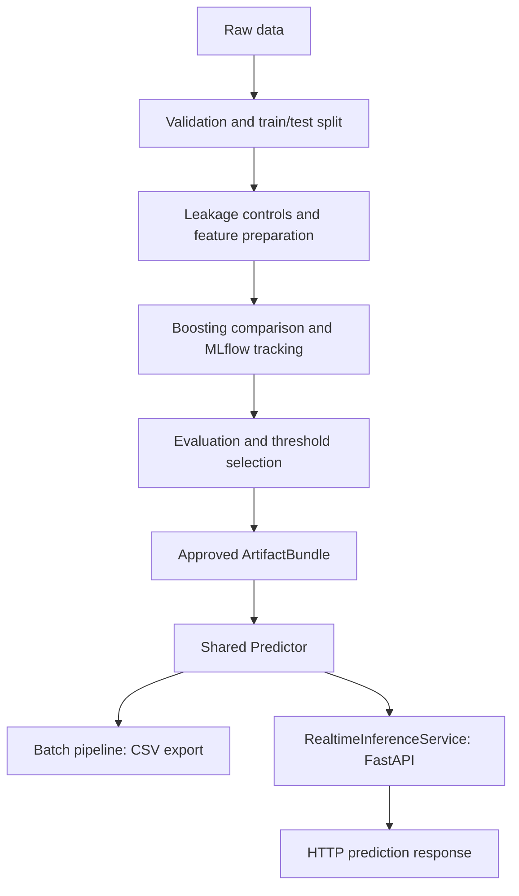

<h1 align="center">BNPL Credit Risk</h1>

**Helping Buy Now, Pay Later teams assess repayment risk at checkout and balance credit losses with access to installment payments.**

[](pyproject.toml)
[](poetry.lock)
[](src/bnpl_credit_risk/api/)
[](src/bnpl_credit_risk/tracking/)
[](.github/workflows/api-tests.yml)

## Business problem

Buy Now, Pay Later lets customers purchase today and repay in installments. For the provider, each application creates a trade-off: accepting a customer who does not repay can create a credit loss; declining a customer who would repay can mean a lost sale and customer relationship.

This project estimates **non-repayment risk using information available at checkout**. It provides a consistent risk signal that a credit team can use alongside its lending policy.

| Business need | Project capability | Intended use |
|---|---|---|
| Assess a new application | Real-time probability and binary risk class through an API | Inform an approval or review workflow |
| Prioritize applications for review | Risk bands and a configurable decision threshold | Direct attention to higher-risk applications |
| Evaluate decisions retrospectively | Batch export comparing predictions with observed outcomes | Identify missed defaults and repayment cases incorrectly flagged |
| Trace a risk assessment | Model version, scoring timestamp and request identifier | Identify which model produced a prediction |

These are intended uses. The repository implements scoring and evaluation; credit approval, manual review and lending rules belong to the consuming business application.

## Understanding the risk decision

The model estimates the probability that a BNPL transaction will default. A threshold saved with the model converts that probability into a binary prediction.

| Class | Display label | Rule |
|---|---|---|
| `0` | **Repayment predicted** | Default probability is below the threshold |
| `1` | **Non-repayment predicted** | Default probability reaches or exceeds the threshold |

These are model predictions, not guarantees of repayment or automatic credit approval decisions. The threshold is selected during evaluation and reused at inference time; it is not necessarily `0.5`.

### The business trade-off behind the threshold

- **Missed default:** the model predicts repayment but the customer defaults. This can expose the provider to a credit loss.
- **False alert:** the model predicts non-repayment but the customer repays. Acting on that alert could unnecessarily restrict access to credit.

Lowering the threshold flags more applications, generally catching more defaults while increasing false alerts. Raising it generally reduces alerts while allowing more defaults to go undetected.

The current threshold maximizes **F1**, a statistical balance between precision and recall. It does **not** optimize business profit or loss. A business-driven threshold would also need exposure amounts, loss given default, transaction margins and review costs.

## What this project delivers

The implementation connects this business question to a reproducible model-development and serving workflow:

- **Eight notebooks**, from data discovery to real-time HTTP tests.
- **XGBoost, LightGBM and CatBoost comparison**, with out-of-fold evaluation and MLflow tracking.
- **Versioned model artifacts**, including the input schema, metrics, threshold and risk bands.
- **Batch inference**, with a detailed CSV linking predictions to observed labels on the test partition.
- **FastAPI inference**, with Pydantic validation, API-key authentication, Loguru logs and Prometheus metrics.
- **Automated tests and deployment files**, including an API Dockerfile, Compose configuration and GitHub Actions workflow.

## Contents

- [Business problem](#business-problem)
- [Understanding the risk decision](#understanding-the-risk-decision)
- [Get started](#get-started)
- [Notebook workflow](#notebook-workflow)
- [Architecture](#architecture)
- [Data and leakage controls](#data-and-leakage-controls)
- [Published model snapshot](#published-model-snapshot)
- [Run the API](#run-the-api)
- [Batch inference and CSV export](#batch-inference-and-csv-export)
- [Configuration and MLflow](#configuration-and-mlflow)
- [Docker deployment](#docker-deployment)
- [Tests and quality checks](#tests-and-quality-checks)
- [Project structure](#project-structure)
- [Further documentation](#further-documentation)

## Get started

### 1. Install the project

Use Python **3.11 or 3.12** and Poetry. The CI workflow uses Poetry 2.1.3.

```bash
git clone https://github.com/Manda404/BNPL-Credit-Risk.git
cd BNPL-Credit-Risk
poetry install
poetry env info --executable
```

Select the Python environment returned by the last command as your notebook kernel.

### 2. Check the configuration

Before training, review `configs/training.yaml`. Its MLflow settings currently point to a developer's local storage. Set `tracking_uri` and `artifact_uri` to locations available on your machine, or set `mlflow.enabled: false` to run without tracking.

Validate the raw dataset:

```bash
poetry run bnpl-risk validate
```

### 3. Publish a model, then score it

Run notebooks **00 → 05** for the guided model-development workflow. Complete the publication cell in notebook **05** before running **06** or **07**.

Generated model artifacts are ignored by Git. A fresh clone needs a locally published model, or a trusted artifact bundle copied into `artifacts/models/`; cloning the repository alone does not provide a runnable model.

Already have an approved model? Go directly to [Run the API](#run-the-api) or open [notebook 06](notebooks/06_batch_inference.ipynb) for the detailed batch export.

## Notebook workflow

The notebooks call reusable Python classes from `src/bnpl_credit_risk/`. Model loading, validation and scoring live in the package.

| Notebook | Purpose | Main result |
|---|---|---|
| [00 — Data discovery](notebooks/00_data_discovery.ipynb) | Inspect the raw dataset | Initial data profile |
| [01 — Data validation](notebooks/01_data_validation.ipynb) | Validate the contract and export a stratified split | Train/test CSV files |
| [02 — Exploratory analysis](notebooks/02_exploratory_data_analysis.ipynb) | Explore distributions, drift and leakage | Data diagnostics and application-time datasets |
| [03 — Feature engineering](notebooks/03_feature_engineering.ipynb) | Build configured features | Prepared development/test datasets |
| [04 — Model training](notebooks/04_model_training.ipynb) | Compare XGBoost, LightGBM and CatBoost | Saved benchmark and tracked runs |
| [05 — Model evaluation](notebooks/05_model_evaluation.ipynb) | Evaluate the selected model, choose a threshold and publish | Approved inference artifact |
| [06 — Batch inference](notebooks/06_batch_inference.ipynb) | Score the labeled test partition | `data/output/submission.csv` with 11 columns |
| [07 — Real-time inference](notebooks/07_realtime_inference.ipynb) | Check the environment, launch the API and test HTTP requests | Two accepted requests, two validation errors and API/batch parity checks |

Notebook 07 starts a local server with `poetry run bnpl-api`, supplies a temporary API key and includes a shutdown cell. Run it step by step; stop any existing server on port 8000 before launching another one.

## Architecture



An `ArtifactBundle` groups the saved model with `metadata.json`, `metrics.json`, `threshold.json` and `feature_schema.json`. The model can be a fitted boosting wrapper or a compatible sklearn pipeline. Inference uses the transformations saved with that artifact and never calls `fit`.

The API loads and checks one model per process, runs a synthetic warmup prediction, then serves requests. Both serving paths use `Predictor` for probabilities, threshold decisions and risk bands.

## Data and leakage controls

The raw dataset contains **10,345 transactions and 17 columns**. Its binary target is `default_flag`.

The project separates two scopes:

| Scope | Intended use | Input restrictions |
|---|---|---|
| **`application_risk`** | Scoring at checkout | Excludes post-origination signals and undocumented target proxies |
| `behavioral_risk` | Monitoring after origination | Allows additional repayment-related signals |

For application-time scoring, the leakage guard excludes `repayment_delay_days`, `missed_payments`, `risk_score` and `customer_segment`. Repayment events are unavailable at checkout; `risk_score` and its derived segment are excluded because their provenance and pre-checkout availability are not established.

The API serves **`application_risk` only**. It rejects extra request fields, including the target and behavioral variables. Details: [data contract](docs/data_contract.md).

## Published model snapshot

The following values come from the locally published **`2026-08-28_131115`** artifact, produced by notebooks 04–05. They describe this run, not every future model or a production performance guarantee.

| Item | Value |
|---|---|
| Selected algorithm | CatBoost |
| Scope | `application_risk` |
| Development / reserved test rows | 9,310 / 1,035 |
| Test ROC-AUC | 0.7144 |
| Test PR-AUC | 0.5842 |
| Test precision / recall | 0.4875 / 0.9208 |
| Test F1 | 0.6375 |
| Test Brier score | 0.2051 |
| Decision threshold | 0.293952 — best F1 on development out-of-fold predictions |

**Business interpretation:** on this reserved test set, the model flags about **92 out of 100 actual defaults**. Among every 100 applications flagged, about **49 actually default** and **51 repay**. This operating point catches most defaults but would create substantial unnecessary declines if every alert automatically triggered rejection.

Business impact has not been measured in a live lending workflow. Before using scores to drive decisions, evaluate the default rate among accepted applications, approval rate, review volume and net credit losses under the proposed policy.

The notebook workflow materializes a stratified split configured in `configs/data_split.yaml`. The separate CLI training workflow uses `configs/training.yaml`; its default time-based split is a different evaluation setup. Do not mix their reported metrics.

Inspect the active artifact's metadata and metrics, or use authenticated `GET /v1/model` for the version and threshold currently served by the API.

## Run the API

### Start from a terminal

With an approved model available, run both commands in the **same terminal**:

```bash
export BNPL_API_API_KEY="$(poetry run python -c 'import secrets; print(secrets.token_urlsafe(32))')"
poetry run bnpl-api
```

The API key is required, including in development. Without it, startup fails with `api_key: Field required`. An existing notebook or another terminal does not automatically inherit an exported variable. Keep the same key on the server and client; do not generate a different one for each side.

In another terminal, check the public readiness endpoint:

```bash
curl --fail http://127.0.0.1:8000/health/ready
```

Expected response: `{"status":"ready"}`. Interactive documentation is available at **http://127.0.0.1:8000/docs** in development. The root URL `/` has no route and returns 404. Use **Ctrl+C** to stop the terminal server.

### Send a prediction request

Run this from a client terminal where `BNPL_API_API_KEY` contains the **same key** used by the server:

```bash
curl --fail-with-body http://127.0.0.1:8000/v1/predict \
  -H "X-API-Key: $BNPL_API_API_KEY" \
  -H 'Content-Type: application/json' \
  -d '{
    "user_id": 123,
    "age": 35,
    "employment_type": "Salaried",
    "monthly_income": 4000,
    "credit_score": 700,
    "purchase_amount": 300,
    "product_category": "Electronics",
    "bnpl_installments": 3,
    "app_usage_frequency": 10,
    "location": "USA",
    "transaction_date": "2026-01-01",
    "debt_to_income_ratio": 0.2
  }'
```

The response includes `user_id`, `default_probability`, **`default_risk_class`**, `decision_threshold`, `risk_band`, `model_version`, a UTC `scoring_timestamp` and `request_id`. The notebook adds the readable class label when displaying this response.

| Endpoint | Access | Purpose |
|---|---|---|
| `GET /health/live` | Public | Process liveness |
| `GET /health/ready` | Public | Service loaded after successful warmup |
| `GET /v1/model` | API key | Loaded model version, threshold and input contract |
| `POST /v1/predict` | API key | One prediction per request |
| `GET /metrics` | API key | Prometheus request counts and latency histograms |

**Validation:** Pydantic checks fields and types; the project validator enforces configured bounds and categories. Invalid input returns **422**, an incorrect key **401**, an oversized body **413**, and exhausted scoring capacity **503**. The service allows one simultaneous prediction per process by default.

**Logs:** Loguru emits structured JSON with event names, request IDs and model/version context. Request bodies and API keys are not logged by the API layer. A `prediction_completed` event with `request_id=startup` is the synthetic warmup test.

## Batch inference and CSV export

### Score new applications

For a CSV without observed outcomes:

```bash
poetry run bnpl-risk predict-batch \
  --input data/processed/applications_to_score.csv \
  --output data/predictions/predictions.csv \
  --model-version latest
```

Provide your own input file at that path. Required input fields follow the configured data contract. The ordinary batch output retains the historical class name **`predicted_default`**; it applies the same threshold rule as the API's `default_risk_class`.

### Export the labeled test partition

Run **notebook 06** to create `data/output/submission.csv`. It uses the test dataset, keeps the observed target out of the model input and joins labels back by `user_id` after scoring.

| Column | Meaning |
|---|---|
| `user_id` | Identifier linking the prediction to the input |
| `default_probability` | Estimated default probability |
| `default_risk_class` | Binary prediction: 0 or 1 |
| `predicted_class` | `Repayment predicted` or `Non-repayment predicted` |
| `predicted_label` | Compatibility alias of `default_risk_class` |
| `true_label` | Observed outcome from the test dataset |
| `prediction_correct` | Whether prediction and observed outcome match |
| `decision_threshold` | Threshold saved with the model |
| `risk_band` | Probability band defined in the artifact |
| `model_version` | Version used for scoring |
| `scoring_timestamp` | Timestamp of the batch scoring run |

Column selection and output location are configured in [configs/inference.yaml](configs/inference.yaml). Writes are atomic. `true_label` and `prediction_correct` belong to this labeled evaluation export; they are not available for new applications whose outcomes are unknown.

## Configuration and MLflow

| Configuration | Controls |
|---|---|
| [configs/data.yaml](configs/data.yaml) | Data schema, bounds and allowed categories |
| [configs/data_split.yaml](configs/data_split.yaml) | Materialized split for the notebook workflow |
| [configs/features.yaml](configs/features.yaml) | Feature definitions and leakage exclusions |
| [configs/model.yaml](configs/model.yaml) | Scope, training parameters and boosting benchmark |
| [configs/training.yaml](configs/training.yaml) | CLI split, threshold policy, risk bands and MLflow |
| [configs/inference.yaml](configs/inference.yaml) | Model selection, validation and export columns |
| [configs/logging.yaml](configs/logging.yaml) | Pipeline logging |
| [.env.api.example](.env.api.example) | API environment-variable template |

General paths can be overridden through `BNPL_*` variables, such as `BNPL_ARTIFACTS_DIR`. API settings use `BNPL_API_*`, including `API_KEY`, `MODEL_VERSION`, `ENVIRONMENT`, `HOST`, `PORT` and concurrency limits. The API configures its own JSON logging through `BNPL_API_LOG_LEVEL`.

When enabled, MLflow records benchmark/model runs, metrics, predictions, diagnostic figures and publication information. Configure its storage before running notebooks 04–05. The serving API reads the local approved artifact registry; it does not require a running MLflow server to score requests.

The Typer commands `bnpl-risk train` and `bnpl-risk evaluate` remain available for the separate sklearn/XGBoost workflow. Use notebooks 04–05 for the multi-model benchmark described above.

## Docker deployment

Set the API key as shown above and pin a version present in your local artifact registry:

```bash
# Replace this with the exact approved version you want to serve.
export BNPL_API_MODEL_VERSION=2026-08-28_131115
docker compose -f docker-compose.api.yml up --build -d
```

The API image runs as a non-root user. Compose mounts `artifacts/models` read-only, supplies resource limits and exposes the service on the host's loopback interface. Model files and secrets are not bundled into the image.

Production mode requires an explicit model version and disables Swagger. TLS, external access control, secret rotation, alerting and capacity/load testing must be provided by the deployment platform. The container configuration is included; local container execution has not yet been validated because the Docker daemon was unavailable during implementation.

## Tests and quality checks

```bash
# Full suite; Agg avoids graphical display requirements.
MPLBACKEND=Agg poetry run python -m pytest --no-cov

# Focused API and export checks.
poetry run python -m pytest tests/integration/test_realtime_api.py \
  tests/integration/test_submission_export.py --no-cov

poetry run python -m ruff check src/bnpl_credit_risk/api \
  tests/integration/test_realtime_api.py tests/integration/test_submission_export.py \
  notebooks/07_realtime_inference.ipynb
poetry run python -m mypy src/bnpl_credit_risk/api --follow-imports=silent
poetry check --lock
```

Tests cover data contracts, leakage controls, training/scoring integration, API authentication, Pydantic errors, concurrency limits, lifecycle handling, model compatibility, API prediction parity and detailed CSV exports. The latest local full-suite verification passed **138 tests**.

`httpx2` is included in development dependencies for Starlette's `TestClient`; `httpx` remains the HTTP client used by the API consumer and live notebook requests. After updating dependencies, restart an already running notebook kernel.

The [API checks workflow](.github/workflows/api-tests.yml) defines lint, type checks, the test suite and a Docker build. A configured workflow is not evidence that its remote run or deployment has already succeeded.

## Project structure

```text
configs/                         Versioned data, model and pipeline configuration
notebooks/                       Guided workflow: 00 through 07
src/bnpl_credit_risk/
├── api/                         FastAPI app, schemas, service, middleware and client
├── data/                        Loading, cleaning, validation, splitting and drift
├── features/                    Feature engineering, preprocessing and leakage controls
├── models/                      Model implementations, calibration and persistence
├── evaluation/                  Metrics, threshold selection and diagnostics
├── inference/                   Shared Predictor and file-based batch scoring
├── pipelines/                   Training, evaluation and inference orchestration
├── tracking/                    MLflow tracking and model publication
├── visualization/               Analysis and reporting figures
└── cli.py                       bnpl-risk commands
artifacts/models/                Local versioned artifacts and latest.json
data/                           Raw, intermediate, prepared and output datasets
tests/                           Unit, integration and regression tests
docs/                            Data, modeling, inference and deployment guides
Dockerfile.api                   API container image
docker-compose.api.yml          API runtime configuration
```

## Further documentation

| Guide | Focus |
|---|---|
| [API walkthrough](README_API.md) | Classes, functions and the complete request lifecycle, in French |
| [API operations](docs/realtime_api.md) | Configuration, endpoints, monitoring and rollback |
| [Batch inference](docs/inference.md) | Input/output contracts and orchestration |
| [Data contract](docs/data_contract.md) | Validation rules and leakage analysis |
| [Architecture](docs/architecture.md) | Package organization and original pipeline design |
| [Modeling](docs/modeling.md) | Split strategies, thresholds and the original sklearn workflow |
| [Model card](docs/model_card.md) | Intended use and limitations of the original reference model |
| [Notebook migration](docs/notebook_migration.md) | Correspondence with the original exploratory notebook |

Historical modeling documentation describes earlier reference runs. For the model you actually serve, use its versioned metadata, metrics and threshold files and the results of notebook 05.
